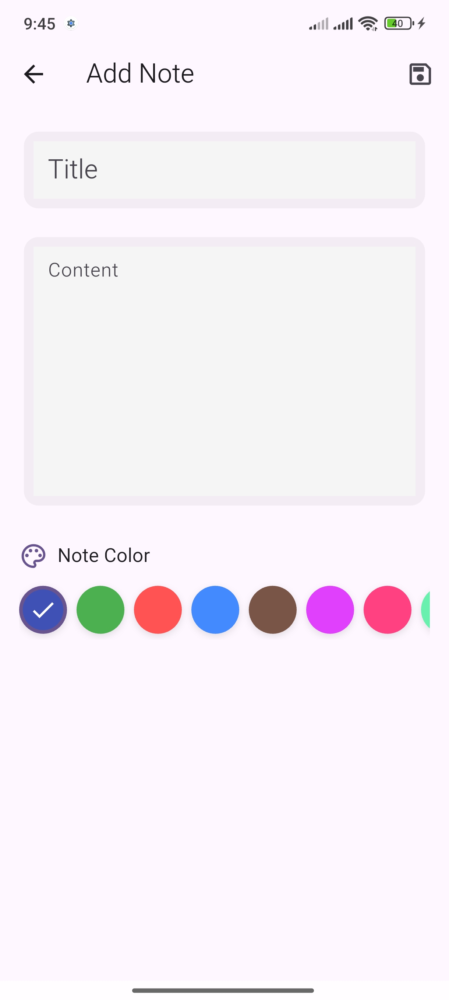
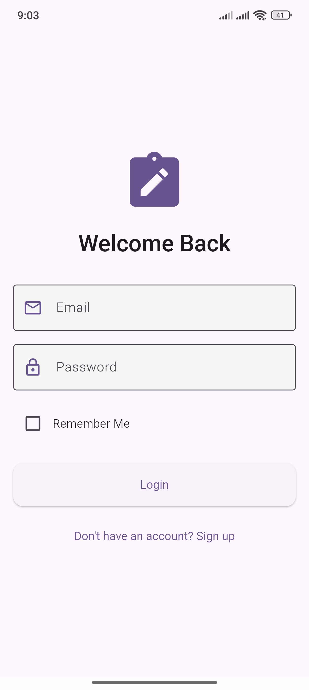
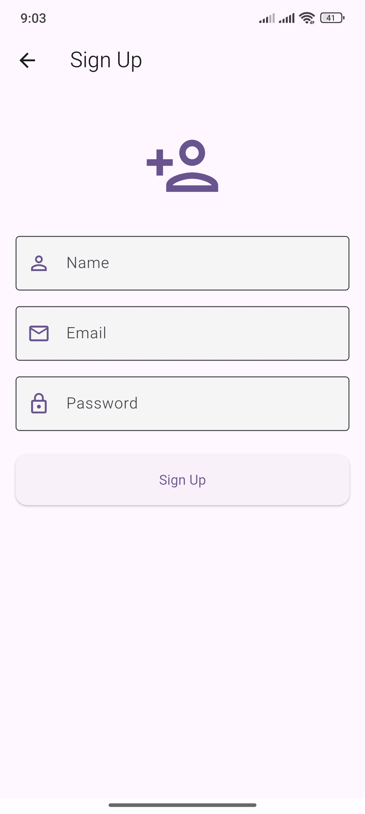
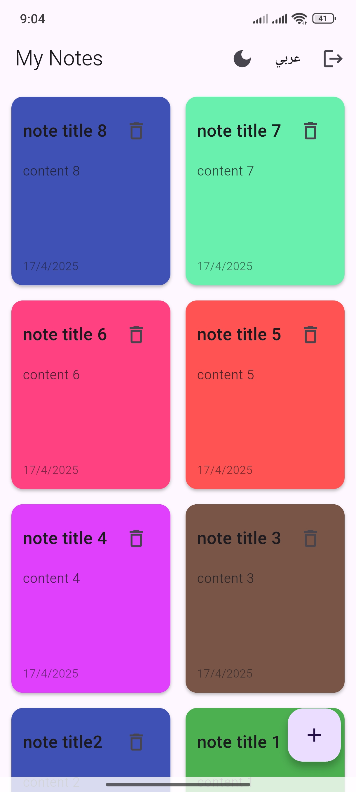
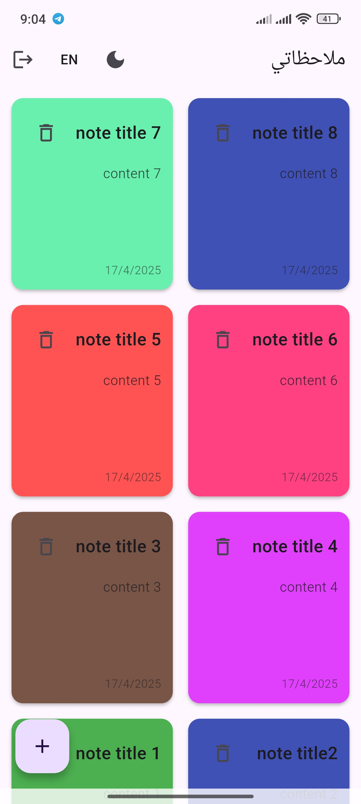
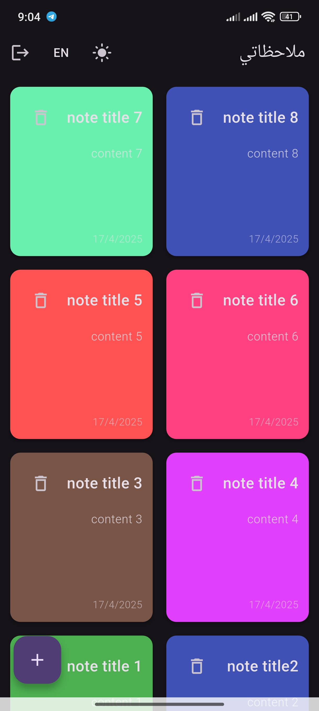
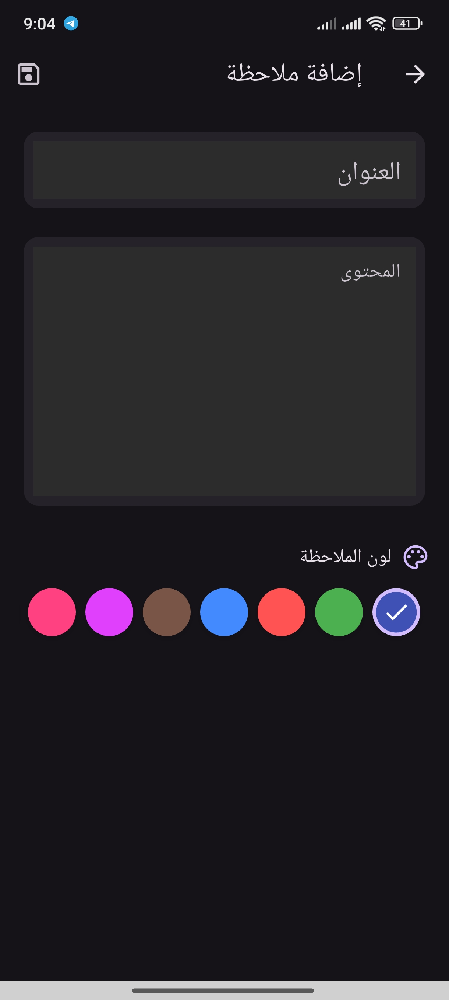
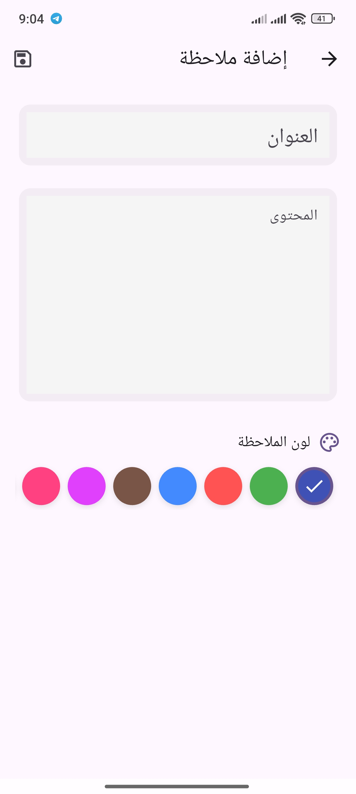
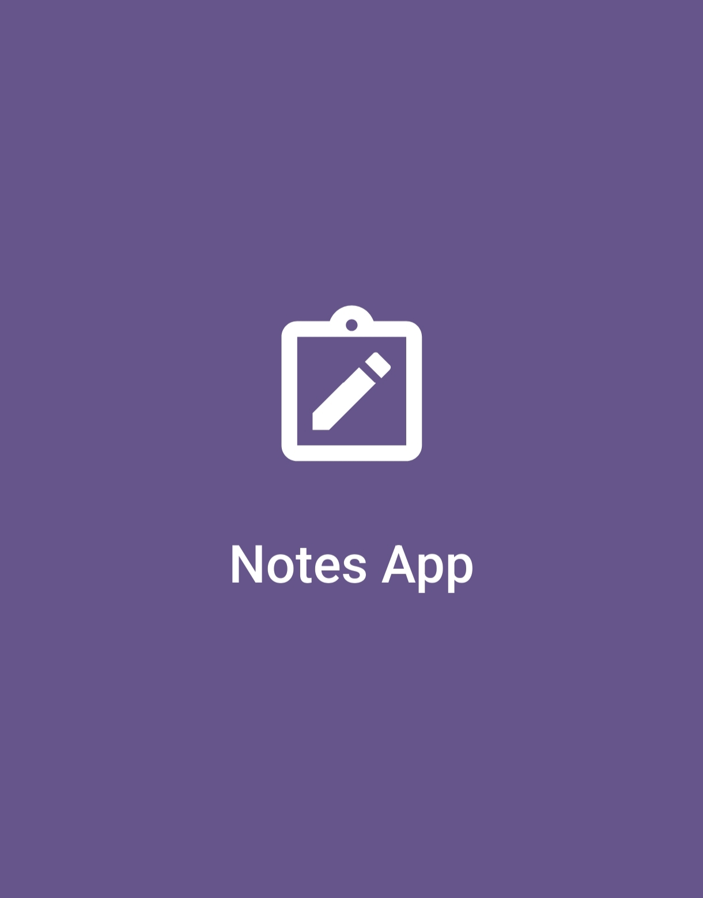

# Notes App

A feature-rich Flutter application for creating, managing, and organizing notes with authentication, theming, and multilingual support.

## Features

- **User Authentication**: Secure sign-up and login functionality
- **Create and Manage Notes**: Add, edit, and delete personal notes
- **Rich Text Notes**: Full text formatting support
- **Color Coding**: Organize notes with different colors
- **Dark/Light Theme**: Toggle between light and dark themes
- **Multilingual Support**: 
  - English
  - Arabic
  - Right-to-left (RTL) support for Arabic text
- **Persistent Storage**: Notes and preferences are stored locally using SQLite
- **Session Management**: Remember user login state

## Screenshots

<h2>📸 Screenshots</h2>
<p>
  
  
  
</p>
<p>
  
  
  
</p>
<p>
  
  
  
</p>


## Installation

### Prerequisites

- Flutter SDK (v3.7.2 or later)
- Dart SDK (v3.0.0 or later)
- Android Studio / VS Code
- Android Emulator / iOS Simulator

### Steps

1. Clone the repository:
   ```
   git clone https://github.com/yourusername/notes_app.git
   ```

2. Navigate to the project folder:
   ```
   cd notes_app
   ```

3. Get dependencies:
   ```
   flutter pub get
   ```

4. Run the application:
   ```
   flutter run
   ```

## How to Run This Project

After cloning the repository from GitHub, follow these steps to run the project:

1. **Set up Flutter environment**:
   - Make sure Flutter is properly installed and set up on your machine
   - Verify installation by running `flutter doctor` and fixing any issues

2. **Install dependencies**:
   ```
   flutter pub get
   ```

3. **Connect a device**:
   - Connect a physical device via USB or
   - Start an Android emulator or iOS simulator

4. **Build and run**:
   ```
   flutter run
   ```
   
5. **Build for specific platform**:
   - Android APK: `flutter build apk`
   - iOS: `flutter build ios` (requires Xcode on macOS)
   - Web: `flutter build web`

6. **Troubleshooting**:
   - If you encounter any issues, run `flutter clean` and then `flutter pub get`
   - Ensure your Flutter version is compatible (v3.7.2+)
   - Check the GitHub Issues tab for known problems or solutions

## Usage

1. **Sign Up/Login**: Create an account or login with existing credentials
2. **Home Screen**: View all your saved notes
3. **Create Note**: Tap the Add button to create a new note
4. **Edit Note**: Tap on a note to view and edit its content
5. **Delete Note**: Swipe or use the delete button to remove a note
6. **Change Theme**: Toggle between light and dark themes in settings
7. **Change Language**: Switch between English and Arabic in settings

## Technologies Used

- **Flutter**: UI framework
- **Dart**: Programming language
- **Provider**: State management
- **SQLite/sqflite**: Local database storage
- **shared_preferences**: Persistent settings storage
- **intl**: Internationalization
- **crypto**: Password hashing

## Architecture

The project follows a structured architecture:

- **lib/model/**: Data models
- **lib/screens/**: UI screens
- **lib/services/**: Business logic and services
- **lib/l10n/**: Localization

## Contributing

Contributions are welcome! Please feel free to submit a Pull Request.

## License

This project is licensed under the MIT License - see the LICENSE file for details.
